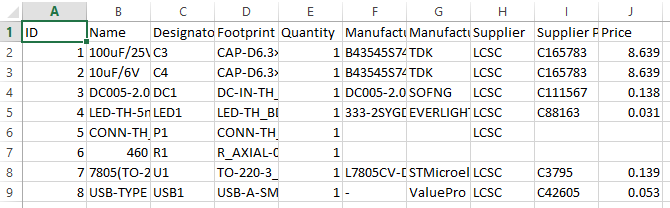
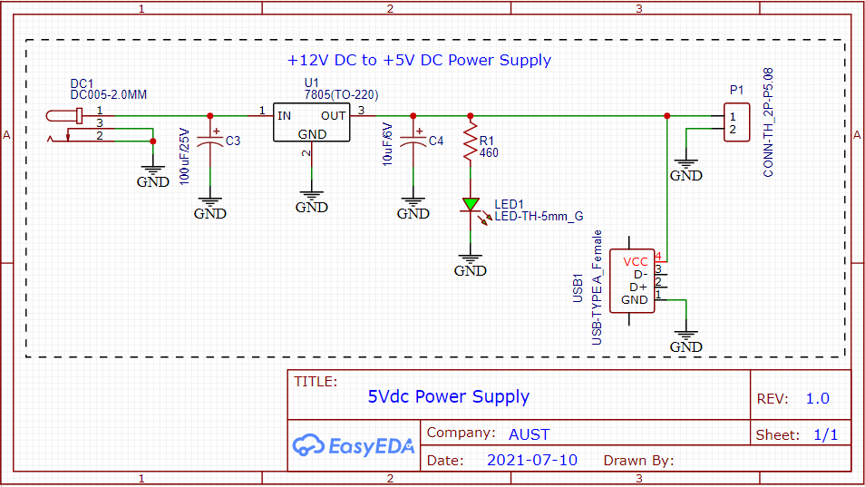
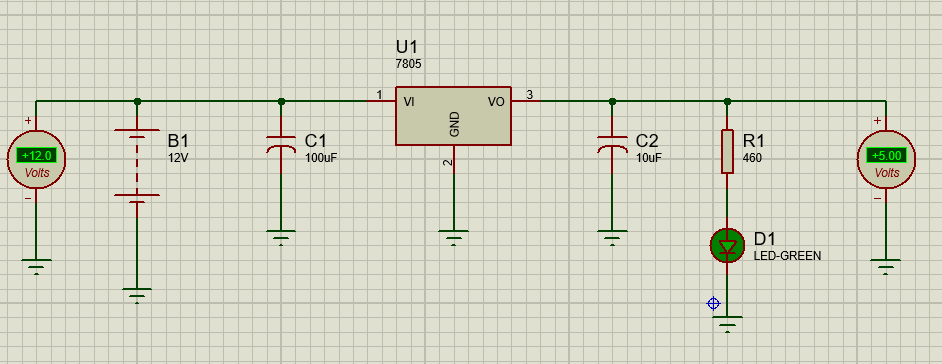
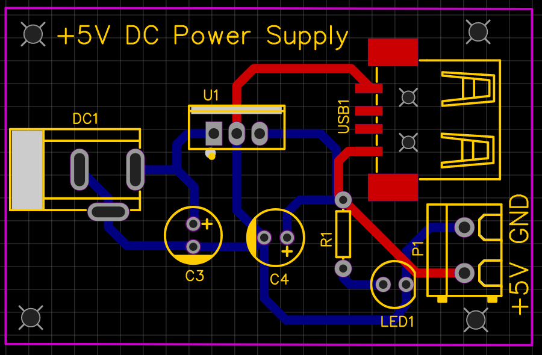
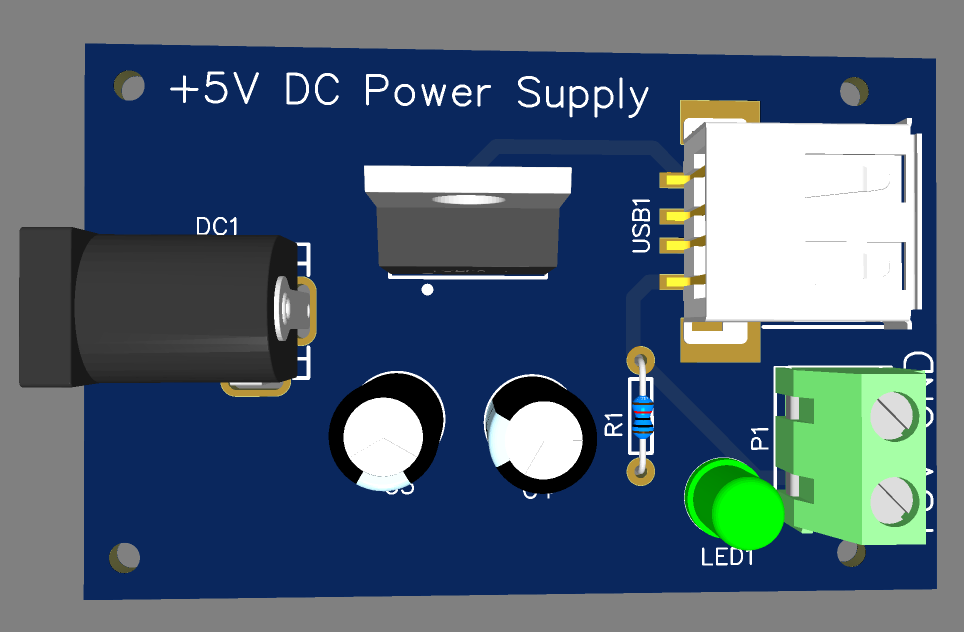
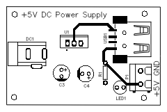
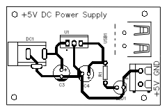

# 12Vdc to 5Vdc Power Supply
## Objectives
The objective of this project is to design and implement a DC power supply that steps down a 12V DC input from a battery to a stable 5V output. This supply powers two devices:
- An Arduino or any other device requiring a 5V input via a T-block.
- A Raspberry Pi via a USB Type-C connector.

## Components Used
1. 12V Battery: Provides the input voltage to the power supply.
2. Capacitors:
- - Input Capacitor: Smoothens fluctuations from the 12V input.
  - Output Capacitor: Stabilizes the output voltage from the regulator.
3. Voltage Regulator (7805): Converts the 12V input to a stable 5V output.
4. LED Indicator: Provides a visual indication of the circuit's operation.
5. T-Block: Connects devices requiring a direct 5V input.
6. USB Type-C Connector: Provides a 5V power output for a Raspberry Pi.
7. Resistor for LED: Limits the current through the LED indicator.

## BOM

## Circuit Design
### Schematic

1. Input Stage:
- - The circuit begins with a 12V battery as the power source.
  - A capacitor is placed immediately after the input to filter out voltage ripples and ensure a stable DC input to the voltage regulator.
2. Voltage Regulation:
- - The 7805 voltage regulator converts the 12V DC input to a stable 5V DC output.
  - The regulator is selected for its ability to handle the required current and provide a consistent output voltage.
3. Output Stabilization:
- - A capacitor is placed after the regulator to further stabilize the 5V output and minimize voltage fluctuations.
4. Indicator Circuit:
- - A LED indicator is connected in parallel with the output to show that the circuit is operational.
  - A current-limiting resistor is included to protect the LED from excessive current.
5. Output Terminals:
- - Two outputs are provided:
- - - A T-Block for powering devices requiring a 5V input.
    - A USB Type-C connector, used to power a Raspberry Pi.
   
## Working Principle
1. The 12V DC input from the battery passes through an input capacitor, which smoothens the voltage by removing any ripples.
2. The filtered 12V is fed into the 7805 voltage regulator, which steps down the voltage to a constant 5V output.
3. The output capacitor stabilizes the 5V DC output to ensure reliable operation of connected devices.
4. The LED indicator provides a visual cue that the circuit is functioning correctly.
5. The 5V output is distributed to two terminals:
- - T-Block: For devices requiring a direct 5V input.
  - USB Type-C Connector: For devices like a Raspberry Pi that need USB Type-C power input.
 
## Simulation Result

## PCB Design
### PCB Routing

### PCB 3D View

### PCB Layouts
#### TOP Layout

#### Bottom Layout

## Advantages
1. Simple and Cost-Effective: The circuit uses readily available components.
2. Dual Outputs: Provides flexibility for powering multiple devices.
3. Stable Output: Ensures reliable operation of connected devices.

## Applications
1. Powering Arduino boards and other microcontrollers.
2. Powering single-board computers such as the Raspberry Pi via USB Type-C.
3. General use in 5V DC applications requiring stable and regulated power.

## Conclusion
The 12V to 5V DC power supply designed in this project is a robust and efficient solution for powering devices requiring a 5V input. The use of a 7805 voltage regulator ensures a steady output voltage, and the dual output terminals enhance versatility. The circuit can be expanded or modified for additional outputs or higher current applications.
