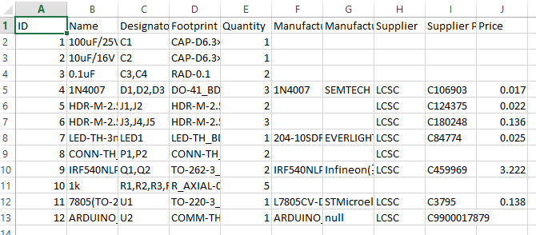
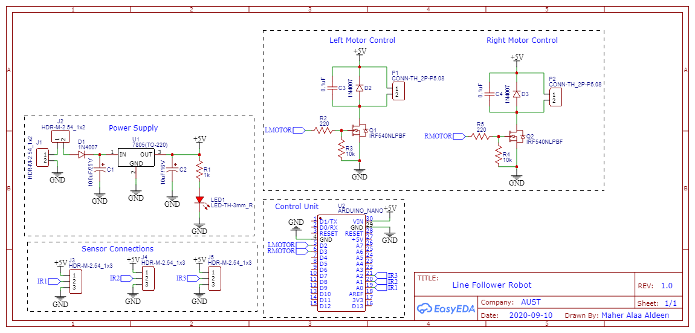
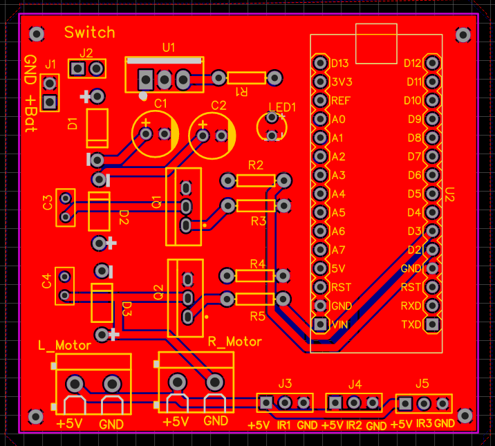
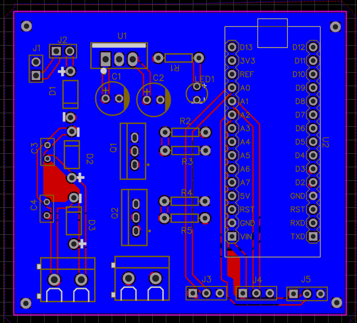
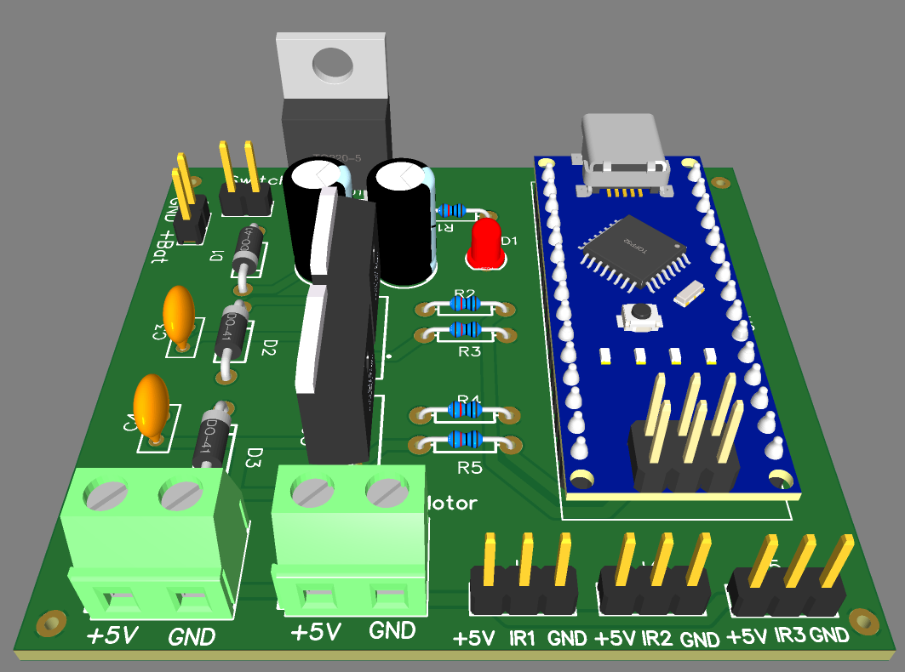
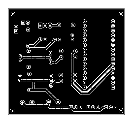
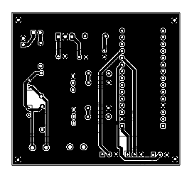

# Line Follower Robot
## Objective
The objective of this project is to design and implement the hardware for a line follower robot. The robot uses IR sensors to detect a line on the ground and adjusts the motion of its motors to follow the line accurately. The hardware design includes a power supply, motor drivers, control unit, and sensor connections, all integrated onto a custom PCB.

## Hardware Components
1. Power Supply:
- - Battery Input: Provides power to the entire circuit.
  - Switch: Turns the power supply on or off.
  - 1N4007 Diode: Protects against reverse polarity connection.
  - Electrolytic Capacitor (100µF/25V): Smoothens the input voltage.
  - Voltage Regulator (7805): Regulates the voltage to 5V DC for the control unit and other components
  - Electrolytic Capacitor (10µF/16V): Further stabilizes the 5V output.
  - LED Indicator: Indicates that the circuit is powered.
2. Control Unit:
- - Embedded Arduino Nano: Acts as the central processing unit for the robot.
  - Connections:
  - - Pins D2 and D3: Connected to the left and right motor drivers respectively.
    - Pins A0, A1, and A2: Connected to the external IR sensors for detecting the line.
3. Sensor Connections:
- - IR Sensors: Three IR sensors are connected externally to the PCB via sensor connections:
  - - Right Sensor: Detects deviations on the right.
    - Middle Sensor: Detects the presence of the line.
    - Left Sensor: Detects deviations on the left.
  - Sensors send analog signals to the Arduino via pins A0, A1, and A2.
4. Motor Drivers: Each motor driver includes:
- - DC Speed Controller:
  - - 1N4007 Diode: Protects the motor from voltage spikes.
    - Ceramic Capacitor (0.1µF): Reduces noise and ensures stable operation.
    - Motor Connection: Connected via T-blocks to the motor.
  - MOSFET (IRF540):
  - - Controlled by a PWM signal from the Arduino through a resistor network.
    - Resistor Network: Voltage divider (R1 = 220Ω and R2 = 10kΩ) conditions the PWM signal.

### BOM



## Circuit Design Overview
### Schematic



1. Power Supply Section:
- - The battery input provides unregulated DC voltage to the PCB.
  - The diode protects against incorrect polarity, and the capacitors smoothen the voltage.
  - The 7805 regulator ensures a stable 5V output for the control unit and motor drivers.
  - A LED indicator provides a visual cue that the system is powered.
2. Control Unit Section:
- - The Arduino Nano is embedded on the PCB and serves as the brain of the robot.
  - Pins D2 and D3 are used to control the left and right motors, while pins A0, A1, and A2 read sensor data.
3. Motor Driver Section:
- - Each motor driver is built around an IRF540 MOSFET.
  - The PWM signal from the Arduino is applied to the MOSFET gate through the resistor network.
  - The 1N4007 diode across the motor terminals prevents back-emf from damaging the circuit.
  - The ceramic capacitor ensures the stability of the motor operation.
4. Sensor Connection Section:
- - IR sensors are placed on the front of the robot.
  - Signals from the sensors are fed into the Arduino to determine the robot’s position relative to the line.

### Working Principle
1. Line Detection:
- - The IR sensors detect the line's position by measuring the reflectivity of the surface.
  - White surfaces reflect IR light, while black lines absorb it.
  - The sensor outputs are fed into the Arduino analog pins A0, A1, and A2.
2. Decision Making:
- - Based on the sensor inputs:
  - - If the middle sensor detects the line, the robot moves forward.
    - If the left sensor detects the line, the robot turns left.
    - If the right sensor detects the line, the robot turns right.
3. Motor Control:
- - The Arduino controls the speed and direction of the motors using PWM signals sent to the MOSFET gates through the resistor network.
  - The speed of the motors is adjusted dynamically to ensure the robot stays on the line.

## PCB Design
### PCB Routing
#### Top Layer



#### Bottom Layer



### PCB 3D View



### PCB Layouts
#### PCB Top Layout



#### PCB Bottom Layout



## Advantages of the Design
1. Compact and efficient integration of the power supply, motor drivers, and control unit on a single PCB.
2. Simple yet robust motor driver design using MOSFETs for speed and direction control.
3. Easily replaceable IR sensors connected externally for flexibility.

## Applications
1. Line-following robots for warehouse automation.
2. Educational robotics projects.
3. Small-scale material handling and transportation systems.

## Arduino Test Code
- Define the pins and Motor Speed
```c
#define LEFT_MOTOR_PIN 2
#define RIGHT_MOTOR_PIN 3
#define LEFT_SENSOR_PIN A0
#define MIDDLE_SENSOR_PIN A1
#define RIGHT_SENSOR_PIN A2

// Motor Speed (PWM)
#define MOTOR_SPEED 150  // Adjust this value (0-255) to control motor speed
```

- Define the Outputs and Inputs
```c
void setup() {
  // Motor pins as output
  pinMode(LEFT_MOTOR_PIN, OUTPUT);
  pinMode(RIGHT_MOTOR_PIN, OUTPUT);

  // Sensor pins as input
  pinMode(LEFT_SENSOR_PIN, INPUT);
  pinMode(MIDDLE_SENSOR_PIN, INPUT);
  pinMode(RIGHT_SENSOR_PIN, INPUT);

  // Initialize motors off
  digitalWrite(LEFT_MOTOR_PIN, LOW);
  digitalWrite(RIGHT_MOTOR_PIN, LOW);

  Serial.begin(9600); // For debugging
}
```
- Main Loop
```c
void loop() {
  // Read sensor values
  int leftSensor = analogRead(LEFT_SENSOR_PIN);
  int middleSensor = analogRead(MIDDLE_SENSOR_PIN);
  int rightSensor = analogRead(RIGHT_SENSOR_PIN);

  // Debugging (optional)
  Serial.print("Left: ");
  Serial.print(leftSensor);
  Serial.print(" | Middle: ");
  Serial.print(middleSensor);
  Serial.print(" | Right: ");
  Serial.println(rightSensor);

  // Threshold for line detection (adjust as needed based on sensor readings)
  int threshold = 500;

  // Determine movement based on sensor inputs
  if (middleSensor > threshold && leftSensor < threshold && rightSensor < threshold) {
    moveForward();
  } else if (leftSensor > threshold && middleSensor < threshold) {
    turnLeft();
  } else if (rightSensor > threshold && middleSensor < threshold) {
    turnRight();
  } else {
    stopMotors();
  }

  delay(100); // Small delay for stability
}
```

- Forward Movement Function:
```c
void moveForward() {
  analogWrite(LEFT_MOTOR_PIN, MOTOR_SPEED);
  analogWrite(RIGHT_MOTOR_PIN, MOTOR_SPEED);
}
```

- Turn Left Function:
```c
void turnLeft() {
  analogWrite(LEFT_MOTOR_PIN, 0);       // Stop the left motor
  analogWrite(RIGHT_MOTOR_PIN, MOTOR_SPEED); // Move the right motor
}
```

- Turn Right Function:
```c
void turnRight() {
  analogWrite(LEFT_MOTOR_PIN, MOTOR_SPEED);  // Move the left motor
  analogWrite(RIGHT_MOTOR_PIN, 0);        // Stop the right motor
}
```

- Stop the Motor Function:
```c
void stopMotors() {
  analogWrite(LEFT_MOTOR_PIN, 0);
  analogWrite(RIGHT_MOTOR_PIN, 0);
}
```

### How It Works
1. Initialization:
- - The motor pins are set as outputs, and the sensor pins are set as inputs.
  - The motors are initialized to be off.
2. Reading Sensor Values:
- - The IR sensors provide analog values depending on the surface reflectivity.
  - A threshold is used to differentiate between a line (black) and the background (white).
3. Decision Logic:
- - If the middle sensor detects the line, the robot moves forward.
  - If the left sensor detects the line, the robot turns left.
  - If the right sensor detects the line, the robot turns right.
  - If no sensor detects the line, the motors are stopped.
4. Motor Control: PWM signals are sent to the motor driver to control the speed and direction of the motors.

### Adjustments
1. Threshold Value: Adjust the Threshold variable based on your sensor readings for better line detection.
2. Motor Speed: Change the Motor Speed value to increase or decrease the speed of the robot.
3. Delay: The delay(100) can be adjusted to make the robot respond faster or slower to changes in the line path.

## Conclusion
This hardware design successfully integrates a power supply, control unit, motor drivers, and sensor connections to create a functional line-following robot. The modular design ensures reliability, and the use of Arduino simplifies programming and debugging. The PCB is optimized for performance, replicating the functionality of a typical line follower robot effectively.

