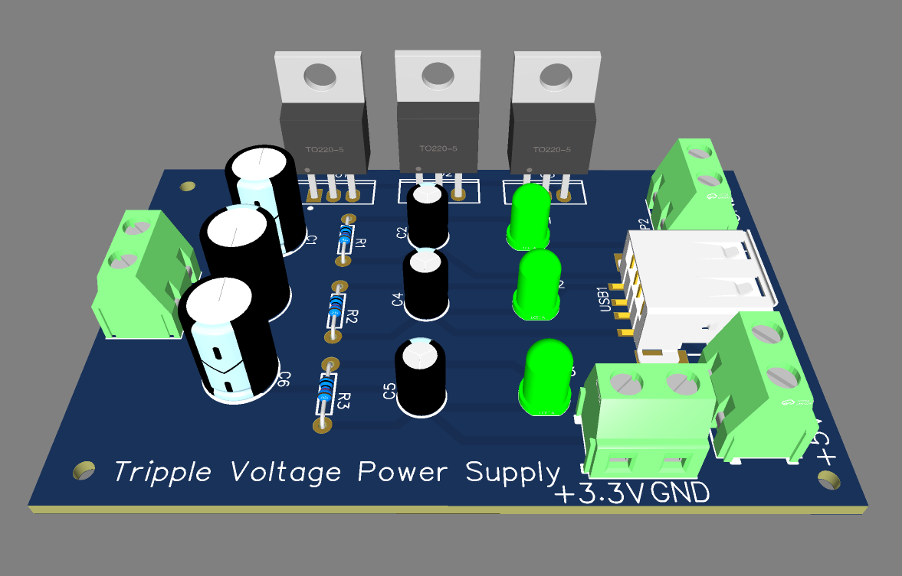

# Tripple Voltage Power Supply
## Objective
The objective of this project is to design a versatile and reliable DC power supply capable of providing three regulated output voltages: 12V, 5V, and 3.3V. This power supply is specifically intended for powering Arduino boards, NodeMCU, ESP modules, Raspberry Pi, and other devices requiring these voltages. It is also designed for general-purpose applications.

## Components Used
1. 12V+ Battery: Primary input source for the power supply.
2. Voltage Regulators:
- - 7812: Provides a regulated 12V output.
  - 7805: Converts 12V to a stable 5V output.
  - LM317 Adjustable Voltage Regulator: Configured to provide a regulated 3.3V output.
3. Capacitors:
- - Input capacitors: Smooth the input voltage for each regulator.
  - Output capacitors: Stabilize the output voltage for each regulator.
4. LED Indicators: Provide visual feedback for each voltage output (12V, 5V, 3.3V).
5. Resistors for LEDs: Limit current through the LEDs.
6. USB Type-C Connector: Provides 5V output for powering a Raspberry Pi.
7. T-Block Connectors: Distribute power to devices requiring 12V, 5V, or 3.3V.

## BOM

## Circuit Design
### Schematic

1. Input Stage:
- - The power supply is powered by a 12V+ battery.
  - A capacitor is placed at the input to filter any noise or ripple in the input voltage.
2. 12V Regulation:
- - The 12V input passes through a 7812 voltage regulator to provide a stable 12V output.
  - An output capacitor stabilizes the 12V DC voltage.
3. 5V Regulation:
- - The 12V input is also fed into a 7805 voltage regulator, which steps it down to a stable 5V output.
  - A capacitor is added at both the input and output of the 7805 to ensure stability and minimize ripple.
  - A USB Type-C connector is connected to this 5V output to power a Raspberry Pi.
4. 3.3V Regulation:
- - The LM317 voltage regulator is used to provide a 3.3V DC voltage.
  - Capacitors are added to the input and output of the LM317 to stabilize the voltage.
5. LED Indicators:
- - Each voltage output (12V, 5V, and 3.3V) is connected to an LED indicator with a series resistor to display its operational status.
6. Output Terminals:
- - T-Block connectors are used to distribute 12V, 5V, and 3.3V to devices.
  - The USB Type-C connector is dedicated to providing 5V to a Raspberry Pi.
 
### Working Principle
1. The 12V+ DC from the battery is filtered using an input capacitor and fed into the regulators:
- - 7812 for the 12V output.
  - 7805 for the 5V output.
  - LM317 for the 3.3V output.
2. Capacitors at the input and output of each regulator ensure that the voltages are stable and free of noise.
3. LED indicators are connected in parallel with each output to show the operational status of the respective voltage.
4. The outputs are distributed via T-Block connectors, with a USB Type-C connector attached to the 5V output for powering a Raspberry Pi.

## Simulation Result

## PCB Design
### PCB Routing

### PCB 3D View

### PCB Layouts
#### TOP Layout

### Bottom Layout

## Advantages
1. Versatile Outputs: Provides multiple voltage levels to support a variety of devices.
2. Stability: Capacitors ensure noise-free and stable outputs.
3. Compact Design: Integrates three voltage levels in one circuit.
4. LED Indicators: Offer quick visual confirmation of circuit operation.

## Applications
1. Microcontroller Power Supply:
- - 3.3V for ESP modules like ESP32 and ESP8266.
  - 5V for Arduino and NodeMCU boards.
2. Single-Board Computer:
- - 5V USB Type-C output for Raspberry Pi.
3. General-Purpose Power Supply:
- - 12V output for sensors, relays, or other 12V devices.
 
## Conclusion
This triple-voltage power supply is a robust and efficient solution for powering Arduino, NodeMCU, ESP modules, Raspberry Pi, and other devices. The inclusion of an LM317 for adjustable voltage adds flexibility to the design. The USB Type-C output ensures compatibility with modern devices like the Raspberry Pi, while the modular design allows for easy scalability and adaptation to different applications.
