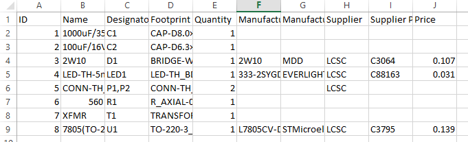
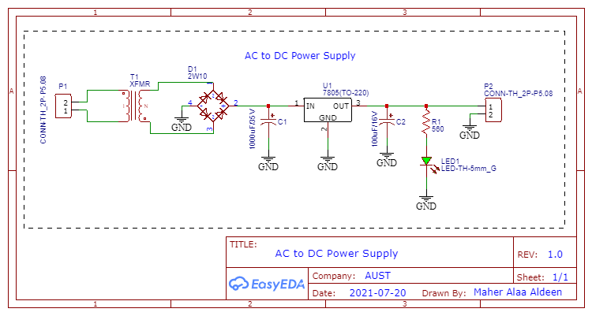
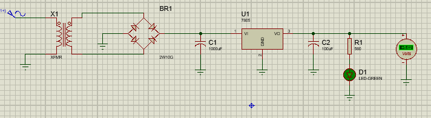
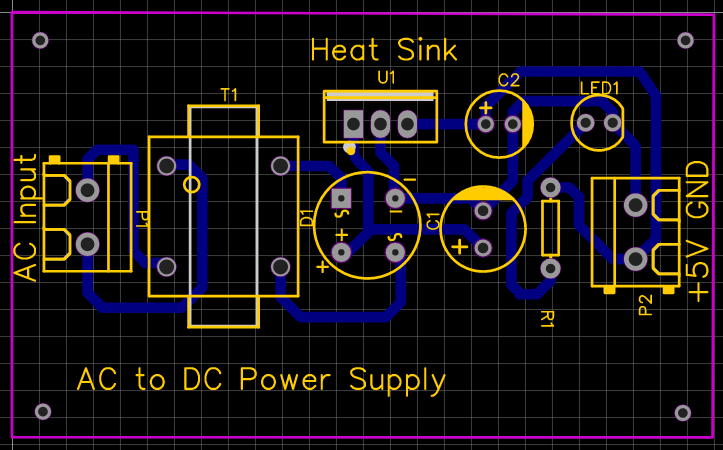
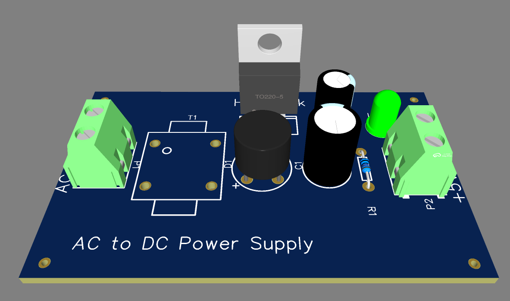
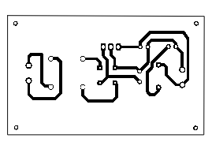

# AC to DC Power Supply
## Objective
The objective of this project is to design and build an AC to DC power supply capable of providing a regulated 5V DC output. This power supply uses a step-down transformer (XFMR) and the essential components of a power supply circuit to achieve the desired output voltage.

## Components Used
1. Transformer (XFMR): Step-down transformer to reduce AC mains voltage to a lower AC voltage.
2. Bridge Rectifier: Converts AC voltage from the transformer into pulsating DC voltage.
3. Filter Capacitor: Smooths the pulsating DC voltage to reduce ripple.
4. Voltage Regulator (7805): Regulates the smoothed DC voltage to a stable 5V output.
5. LED Indicator: Displays the operational status of the power supply.
6. Resistor for LED: Limits current through the LED.

## BOM

## Circuit Design
### Schematic

1. Input Stage:
- - The power supply is connected to a 220V AC mains input.
  - A step-down transformer reduces the mains voltage to 12V AC (rms).
2. Rectification Stage:
- - The secondary output of the transformer is fed into a bridge rectifier consisting of four diodes.
  - The bridge rectifier converts the 12V AC into pulsating DC voltage.
3. Filtering Stage:
- - A filter capacitor is connected to the output of the rectifier to smooth the pulsating DC voltage.
  - The capacitor value is chosen to minimize the ripple voltage.
4. Regulation Stage:
- - The smoothed DC voltage is fed into a 7805 voltage regulator, which provides a stable 5V DC output
  - Capacitors are connected at the input and output of the regulator for improved stability.
5. Output Stage:
- - The 5V DC output is made available for external devices.
  - An LED indicator connected in parallel with the output provides visual confirmation of proper operation.

## Working Principle
1. The 220V AC mains voltage is stepped down to 12V AC using the transformer.
2. The bridge rectifier converts this AC voltage into pulsating DC.
3. The filter capacitor smooths the pulsating DC to produce a near-constant DC voltage of approximately 15.57V.
4. The 7805 regulator converts this smoothed DC voltage into a stable 5V DC.
5. The LED indicator connected to the output provides a visual indication of operation.

### Simulation Result

## PCB Design
### PCB Routing

### PCB 3D View

### PCB Layout

## Advantages
1. Stability: Provides a reliable and consistent 5V DC output.
2. Low Ripple: Filter capacitor minimizes voltage fluctuations.
3. Ease of Use: Simple design with commonly available components.

## Applications
1. Microcontroller Power Supply: Ideal for powering Arduino, ESP modules, and other 5V devices.
2. General-Purpose DC Supply: Can be used for powering low-power DC devices.

## Conclusion
The AC to DC power supply successfully converts 220V AC to a regulated 5V DC output, meeting the design objectives. The inclusion of a bridge rectifier, filter capacitor, and voltage regulator ensures a stable and noise-free output. This power supply is versatile and suitable for a wide range of low-power applications.
