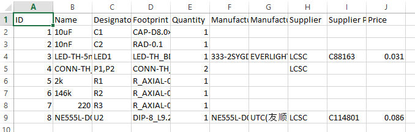
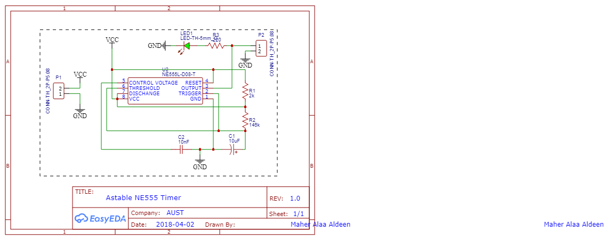
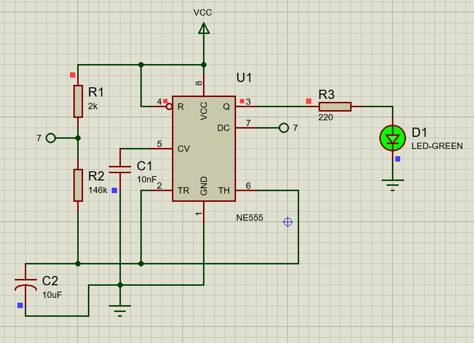
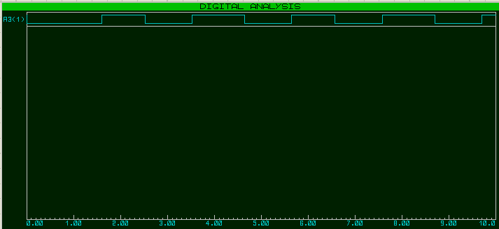
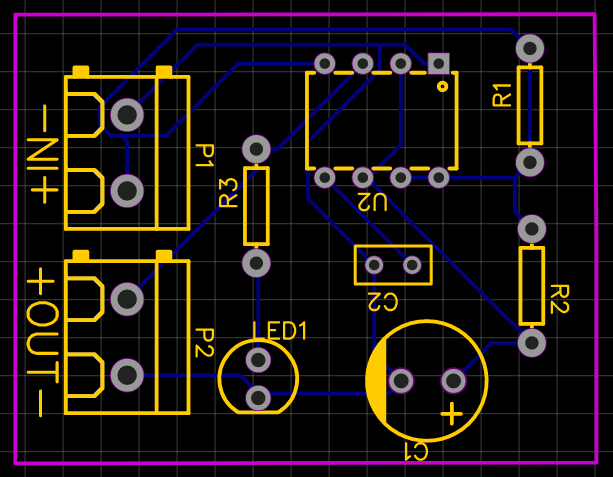
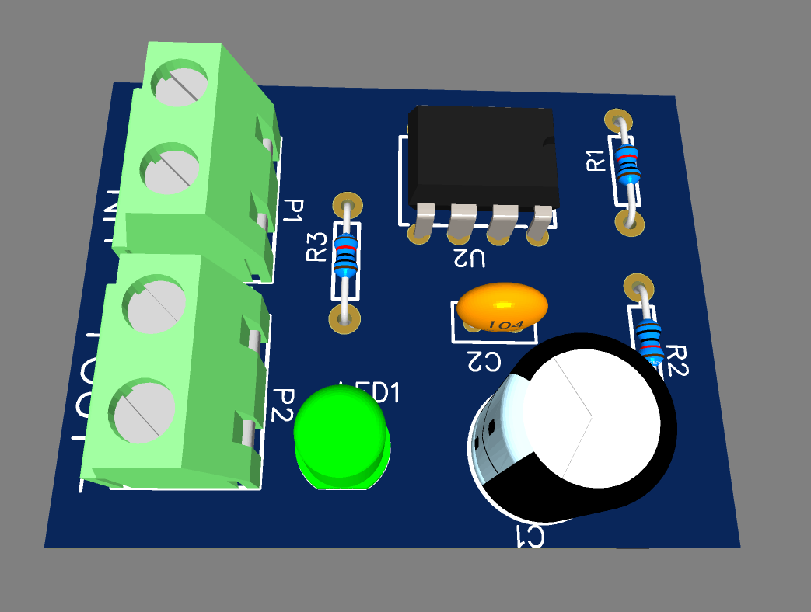
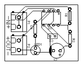

# Astable NE555
## Objective
The objective of this project is to design and implement an astable multivibrator using the NE555 timer IC to generate periodic signals with a frequency of approximately 0.5 Hz. The design
is tailored for sequential circuit applications, with initial requirements specifying Ton ~ 1 sec and Toff ~ 1 sec for a Duty Cycle ~ 50%.

## Components Used
1. NE555 Timer IC: Used to generate the astable signal.
2. Resistors (R1 and R2): Determine the charging and discharging time of the capacitor.
3. Capacitors (C and Decoupling Capacitor): Control the timing and provide stability.
- - Timing capacitor C: 10uF
  - Decoupling ceramic capacitor: 10 nF.

## BOM

## Circuit Design
### Schematic

The NE555 timer is configured in an astable mode to produce a square wave output with alternating Ton and Toff times. The design equations for the on and off times are:
1. On Time: Ton = 0.693x(R1+R2)xC
2. Off Time: Toff = 0.693xR2xC
3. Period T = Ton + Toff
4. Frequency F = 1/T
5. Duty Cycle = (Ton/T)x100

### Design Parameters
To meet the requirements Ton ~ 1sec and Toff ~ 1sec, the following components were selected:
- R1 = 2KΩ
- R2 = 146KΩ
- C = 10μF
- Ceramic decoupling capacitor: 10 nF (to stabilize the power supply and reduce noise).

### Results
1. Ton = 1.026 sec
2. Toff = 1.012 sec
3. F = 0.491 Hz
4. T = 2.037 sec
5. DC = 50.34%

## Working Principle
1. Charging Phase (Ton):
- - During Ton, The capacitor C charges through R1 and R2. The voltage across C rises until it reaches 2/3 Vcc, at which point the timer switches states.
2. Discharging Phase (Toff):
- - During Toff, The capacitor discharges through R2 until the voltage across C drops to 1/3 Vcc, triggering the timer to switch states again.

This cyclical process produces a square wave output with the calculated Ton and Toff.

### Simulation Result

The below figure shows that the Duty Cycle is as required:

## PCB Design
### PCB Routing

### PCB 3D View

### PCB Layout

## Applications
1. Sequential Circuits: Generates clock pulses for sequential logic circuits.
2. Flashing LEDs: Provides timed pulses to drive LEDs or other indicators.
3. Oscillator Circuits: Acts as a square wave generator for various applications.

## Conclusion
The designed astable NE555 timer successfully meets the design requirements with Ton = 1.026 sec and Toff = 1.012 sec. he duty cycle of 50.43% ensures a near-equal division of high and low states. The timer provides a stable and reliable square wave output for sequential circuit applications.
