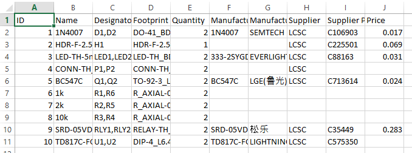
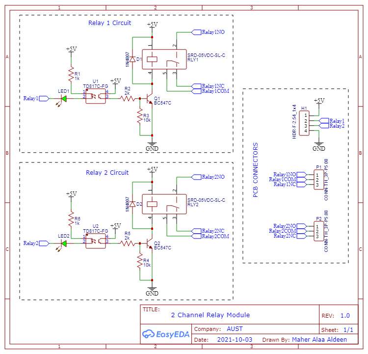
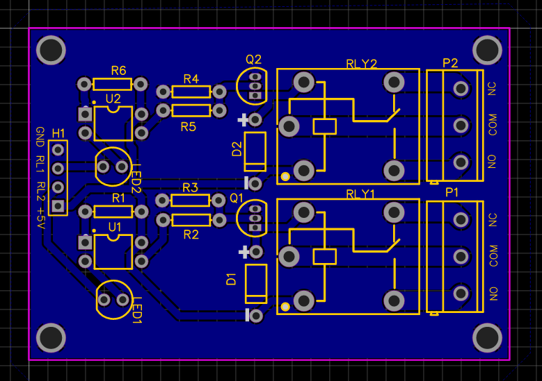
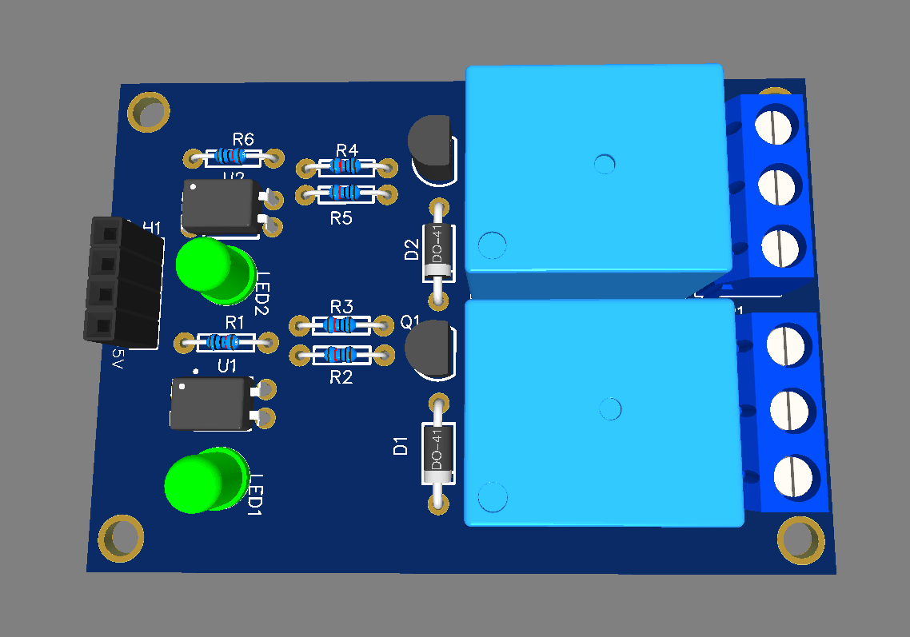
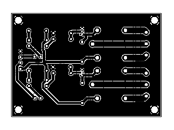

# 2 Channel Relay Module
## Objective
The objective of this project is to design and implement a two-channel relay module that mimics the design and performance of the Arduino 2-channel relay module. 
The design includes optocouplers for electrical isolation, freewheeling diodes to suppress voltage spikes during switching, and LED indicators to display the status of each relay. 
This module is compatible with Arduino and other microcontrollers for safe and reliable control of high-power devices.

## Components Used
1. 2 Relays
- - Electromechanical relays compatible with Arduino.
  - Voltage Rating: 5V DC coil.
2. Optocouplers (2 units):
- - Ensure electrical isolation between the control circuit (microcontroller) and the relay-driving circuit.
3. NPN Transistors (2 units):
- - Used as switches to drive the relay coils (BC547).
4. Freewheeling Diodes (2 units):
- - Protect the circuit from voltage spikes during relay switching (e.g., 1N4007).
5. Resistors:
- - Current-limiting resistors for the optocouplers.
  - Base resistors for the transistors.
6. LED Indicators (2 units):
- - Provide visual feedback for the relay status (ON/OFF).
7. PCB Design:
- - The layout is inspired by the Arduino 2-channel relay module.

## BOM

## Circuit Design
### Schematic

1. Input Control:
- - The control signals from Arduino are routed through optocouplers, isolating the Arduino from the relay-driving circuit.
2. Relay Driver Circuit:
- - NPN transistors are used to drive the relay coils.
  - The base of each transistor is connected to the output of the optocoupler through a current-limiting resistor.
3. Freewheeling Diode:
- - Each relay coil is connected in parallel with a freewheeling diode to suppress voltage spikes.
4. LED Indicator:
- - LEDs are connected in parallel with each relay coil to indicate the relay status.

## Working Principle
1. Input Activation: A control signal from the Arduino activates the optocoupler, which drives the transistor.
2. Relay Activation: When the transistor is switched on, current flows through the relay coil, energizing it and causing the relay contacts to switch.
3. Back EMF Suppression: Freewheeling diodes suppress voltage spikes generated by the relay coils during switching.
4. Output Switching: The relay contacts switch, enabling high-power devices to be controlled safely.
5. Status Indication: The LEDs light up when the relay is energized, providing visual feedback.

## PCB Design
### PCB Routing

### PCB 3D View

### PCB Layout

## Design Features Mimicking Arduino Relay Module
1. Compact PCB Layout: Designed to fit small enclosures similar to the Arduino 2-channel relay module.
2. Pin Configuration: Input pins labeled for compatibility with Arduino (e.g., VCC, GND, IN1, IN2).
3. Compatibility: Designed to work seamlessly with 5V logic levels from Arduino and other microcontrollers.
4. Mounting Holes: Added for easy installation and use in various projects.

## Applications
1. Home Automation: Control appliances such as lights, fans, and other devices.
2. Industrial Automation: Operate machinery and equipment with microcontroller control.
3. Microcontroller Integration: Interface with Arduino, ESP, and other platforms for versatile automation tasks.

## Advantages
1. Electrical isolation ensures the safety of connected microcontrollers.
2. Back EMF protection prevents damage to transistors and other components.
3. Compact and modular design allows for easy integration and deployment.

## Conclusion
This two-channel relay module successfully replicates the design and performance of the Arduino 2-channel relay module. It provides a reliable, safe, and efficient way to control high-power devices using low-power microcontroller signals. The use of optocouplers for isolation, freewheeling diodes for protection, and LED indicators for status visualization makes it a versatile and robust solution for a wide range of applications.
