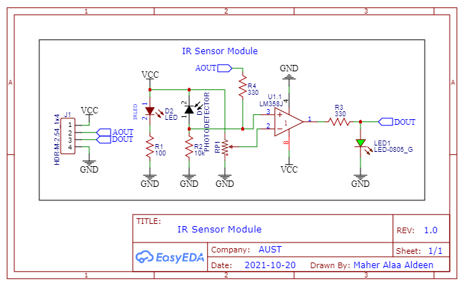
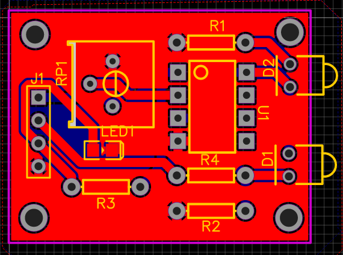

# IR Sensor Module
## Objective
The objective of this project is to design and implement an infrared (IR) sensor module using the LM358 operational amplifier. The module mimics the design and functionality of commercially available IR sensor modules. It is designed for proximity detection and obstacle avoidance in robotics and automation applications.

## Components Used
1. LM358 Operational Amplifier (1 unit):
- - Dual operational amplifier used for signal amplification and comparison.
2. Infrared Emitter (IR LED):
- - Emits infrared light.
3. Infrared Receiver (Photodiode or Phototransistor):
- - Detects reflected infrared light from obstacles.
4. Resistors:
- - Current-limiting resistor for the IR LED.
  - Pull-down resistor for the IR receiver.
  - Resistors for voltage divider circuits in the comparator.
5. Potentiometer:
- - Adjustable resistor for tuning the sensitivity of the sensor module.
6. Indicator LED:
- - Provides a visual indication when an obstacle is detected.

## BOM

## Circuit Design
### Schematic

1. IR Emitter and Receiver:
- - The IR LED emits infrared light.
  - The IR receiver detects the reflected light when an obstacle is present.
2. Signal Conditioning:
- - The signal from the IR receiver is weak and noisy.
  - The LM358 amplifies and processes this signal.
3. Comparator Circuit:
- - One of the LM358's operational amplifiers is configured as a comparator.
  - The reference voltage for comparison is set using a potentiometer.
4. Output Indication:
- - The output of the comparator drives an indicator LED.
  - The LED lights up when the IR sensor detects an obstacle.

### Working Principle

1. Infrared Emission: The IR LED emits a beam of infrared light.
2. Reflection from Obstacle: When an obstacle is within the detection range, the infrared light reflects back toward the IR receiver.
3. Signal Processing:
- - The IR receiver generates a small current proportional to the reflected light intensity.
  - This current is converted into a voltage signal and amplified by the LM358.
4. Comparison:
- - The amplified signal is compared with a reference voltage set by the potentiometer.
  - If the signal exceeds the reference voltage, it indicates the presence of an obstacle.
5. Output Activation: The LM358's comparator output activates the indicator LED, signaling detection.

## PCB Design
### PCB Routing

### PCB 3D View

### PCB Layout
#### PCB Top Layer Layout

#### PCB Bottom Layer Layout

## Applications
1. Robotics: Obstacle detection and avoidance in autonomous robots.
2. Automation Systems: Proximity sensing in conveyor belts and safety mechanisms.
3. Consumer Electronics: Touchless switches and motion detection systems.

## Advantages
1. Low power consumption and efficient design.
2. Adjustable sensitivity through the potentiometer.
3. Compact layout suitable for integration in various systems.

## Conclusion
This IR sensor module effectively mimics the design and performance of commercially available modules. Using the LM358 operational amplifier ensures reliable signal processing and obstacle detection. The adjustable sensitivity makes it versatile for a wide range of applications in robotics and automation systems.
