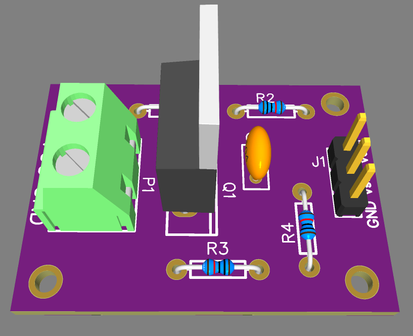

# High DC Voltage Sensor Module
## Objective
The objective of this project is to design and build a high-voltage sensor module capable of measuring DC voltages from 0 to 60 V. The module outputs a proportional voltage suitable for an Arduino's Analog-to-Digital Converter (ADC) input. It utilizes a voltage divider for scaling, a MOSFET for buffering and protection, and additional components for stability and signal conditioning.

## Components Used
1. Voltage Divider Resistors (R1 = 22kΩ, R2 = 2kΩ):
- - Scales the input voltage to a lower range compatible with the Arduino ADC (0–5 V).
2. MOSFET (IRF9Z24):
- - Functions as a buffer to isolate the voltage divider from the Arduino ADC input.
  - Provides additional protection and ensures accurate signal transmission.
3. Resistors (10kΩ, 100Ω):
- - Used with the MOSFET to set operating conditions and stabilize the circuit.
4. Ceramic Capacitor (0.1 µF):
- - Filters high-frequency noise from the voltage divider output.
5. Arduino ADC (Analog Input):
- - Reads the scaled and conditioned voltage and converts it into a digital value for processing.

## BOM

## Circuit Design
### Schematic

1. Voltage Divider:
- - The input voltage (0–60 VDC) is divided using resistors R1 and R2.
  - The output voltage of the divider Vsense is calculated as:
  - - Vsense = Vin (R2/ R1 + R2)
  - for Vin = 60V:
  - - Vsense = 60x(2/22+2) = 5V
  - This ensures the maximum voltage applied to the Arduino ADC input is within the safe range (0–5 V).
2. MOSFET Configuration:
- - The IRF9Z24 MOSFET acts as a voltage buffer.
  - Vctrl: Controls the MOSFET's operation and ensures the output is proportional to Vsense.
  - Resistors (10kΩ and 100Ω) are used to configure the MOSFET's gate and source for stability.
3. Noise Filtering:
- - A 0.1 µF ceramic capacitor is connected across the output of the voltage divider.
  - It removes high-frequency noise and stabilizes Vsense  before it reaches the MOSFET and Arduino ADC.
4. Arduino ADC:
- - The scaled and conditioned voltage is fed to the Arduino's analog pin.
  - The ADC converts the voltage into a digital value for further processing.

### Working Principle
1. Voltage Division:
- - The input voltage is scaled down using a voltage divider.
  - The resulting Vsense is a fraction of the input voltage and is proportional to it.
2. Signal Conditioning and Isolation:
- - The MOSFET buffers the voltage divider output, isolating it from the Arduino ADC.
  - This prevents the ADC's input impedance from affecting the voltage divider's accuracy.
3. Noise Filtering:
- - The ceramic capacitor filters out noise and stabilizes Vsense for accurate ADC readings.
4. Arduino ADC Conversion:
- - The Arduino reads Vsense voltage and converts it into a digital value.
  - The digital value is processed to calculate the actual input voltage using the voltage divider formula:
  - - Vsense = Vin x (R2 / R1 + R2)

### Calculations
1. Voltage Divider Output (Vsense):
- - For Vin: Vsense = Vin x (R2 / R1 + R2)
2. Arduino ADC Conversion:
- - The Arduino's ADC resolution is typically 10 bits (1024 levels).
  - ADC Value (VADC) is calculated as:
  - - VADC = (Vsense/5) x 1023
  - The input voltage is then computed as:
  -  - Vin = (VADC/1023) x 5 x ((R1 + R2)/R2)

## PCB Design
### PCB Routing

### PCB 3D View

### PCB Layout

## Applications
1. Voltage Monitoring in IoT Systems: Monitor battery voltage in remote systems using an Arduino.
2. Embedded Systems: Measure high voltages and integrate them into control and automation systems.
3. Prototyping and Testing: Useful for testing circuits with varying input voltages.

## Advantages
1. Cost-effective and simple design.
2. Safe scaling of high voltage to a range suitable for microcontroller ADCs.
3. Noise filtering ensures stable and accurate measurements.

## Conclusion
The high-voltage sensor module effectively scales and conditions DC voltages from 0 to 60 V for Arduino ADC compatibility. Using a voltage divider, MOSFET buffer, and filtering capacitor, the module provides stable and reliable voltage readings. This module can be integrated into various applications requiring high-voltage monitoring and is a robust alternative to commercial sensor modules.
