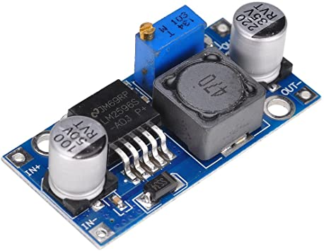
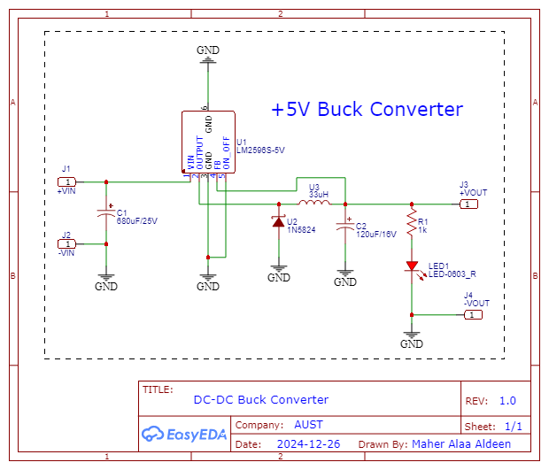
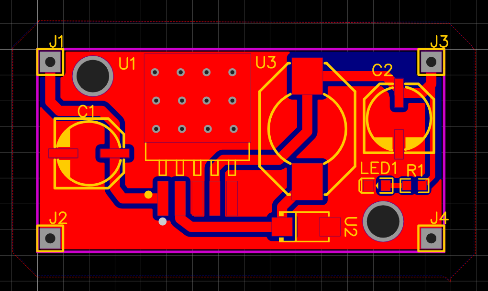
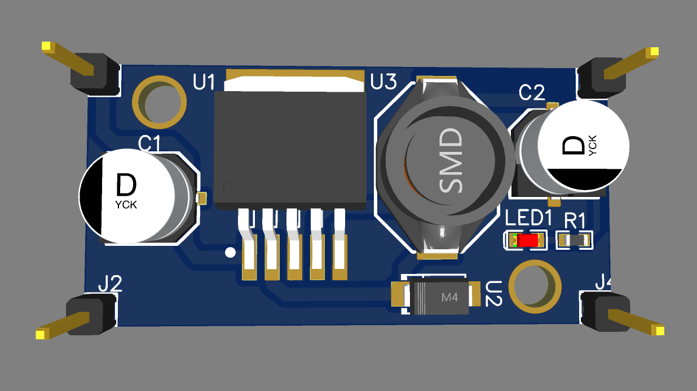
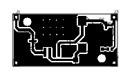

# 5V DC-DC Buck Converter Module
## Objective
The objective of this project is to design and construct a DC-DC buck converter to step down higher input voltages to a stable 5V DC output. This converter mimics the design of the Arduino's 5V buck converter to supply power to microcontrollers, sensors, and other low-voltage device

## Components Used
1. Electrolytic Capacitor (680µF, 25V): Provides input filtering to smooth out voltage ripples and stabilize the input supply.
2. LM2596S: A step-down (buck) voltage regulator IC that reduces the input voltage to 5V with high efficiency.
3. Schottky Diode (1N5824): Protects the circuit and provides a low forward voltage drop, improving efficiency.
4. Inductor (33µH): Smooths the current and reduces ripple at the output.
5. LED Indicator (with a 1kΩ Resistor): Indicates that the circuit is powered and the output is active.
6. Output Terminals (+VOUT and -VOUT): Deliver the regulated 5V DC output for external devices.

## Circuit Design and Working

The objective is to replicate this design:

### Schematic

1. Input Filtering:
- - The input Voltage (Vin) is supplied to the circuit through the +VIN and -VIN terminals.
  - A 680µF electrolytic capacitor is connected across these terminals to smooth out any voltage fluctuations or ripples in the input power. This ensures a stable input voltage for the LM2596S regulator.
2. Voltage Regulation:
- - The LM2596S is the main component of the circuit, functioning as a buck converter. It steps down the input voltage (Vin) to a stable 5V DC output (VOUT).
  - The LM2596S operates using pulse-width modulation (PWM). It switches rapidly between on and off states to control the energy delivered to the load.
  - The switching frequency is typically set internally within the IC, and external passive components (capacitors and inductors) help in filtering and stabilization.
3. Diode and Inductor Functionality:
- - The Schottky diode (1N5824) is placed in the circuit to provide a freewheeling path for the inductor's current when the LM2596S switch is off. This prevents reverse voltage damage and ensures continuous current flow.
  - The inductor (33µH) stores energy during the LM2596S's "on" state and releases it during the "off" state, effectively smoothing the output current and reducing ripple.
4. Output Filtering and Indicator:
- - A ceramic capacitor (part of the LM2596S circuit) further filters out ripples from the output voltage.
  - The LED indicator, with its series resistor (1kΩ), provides a visual indication of circuit operation. If the LED is on, the circuit is functioning, and the output voltage is present.
5. Output Terminals:
- - The +VOUT and -VOUT terminals provide a stable 5V DC output, ready to power devices like microcontrollers, sensors, or other low-voltage electronics.

### Calculations
1. Inductor Value Selection:
- - The inductor value (33µH) is chosen based on the desired output voltage, load current, and switching frequency of the LM2596S.
  - Approximate formula for inductor selection:
  - - L = (Vin - Vout).Vout / fsw.Iload.Vin
  - where:
  - - fsw: switching frequency of LM2596S (150 kHz).
    - Iload: Maximum load current.
2. Output Ripple Voltage:
- - The output ripple voltage is determined by the inductor, output capacitor, and switching frequency.
  - Vripple = Iload/fsw.Cout
3. Resistor Selection for LED:
- - LED forward voltage Vf is typically 2V.
  - Resistor Value:
  - - R = (Vout - Vf)/Iload
    - Assuming Iled = 10mA: R = 1KΩ.

## PCB Design
### PCB Routing

### PCB 3D View

### PCB Layout

## Advantages of the Design
1. High efficiency due to the use of a buck converter IC.
2. Compact and low-cost design suitable for various embedded applications.
3. Visual indication of circuit operation via the LED.
4. Capable of providing stable 5V output for devices with sensitive power requirements.

## Applications
1. Microcontroller Power Supply: Provides a stable 5V source for Arduino, ESP, NodeMCU, or other microcontrollers.
2. Sensor Powering: Powers low-voltage sensors in IoT or robotics projects.
3. General Purpose DC Power: Serves as a power supply for small electronic circuits requiring 5V DC.

## Conclusion
This 5V buck converter effectively steps down higher DC input voltages to a stable 5V output, making it a versatile power supply module for various applications. Mimicking the design of Arduino's 5V buck converter, it combines simplicity, efficiency, and reliability to meet the power needs of microcontrollers, sensors, and other low-power devices.

