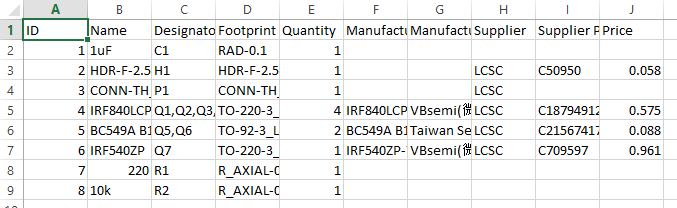
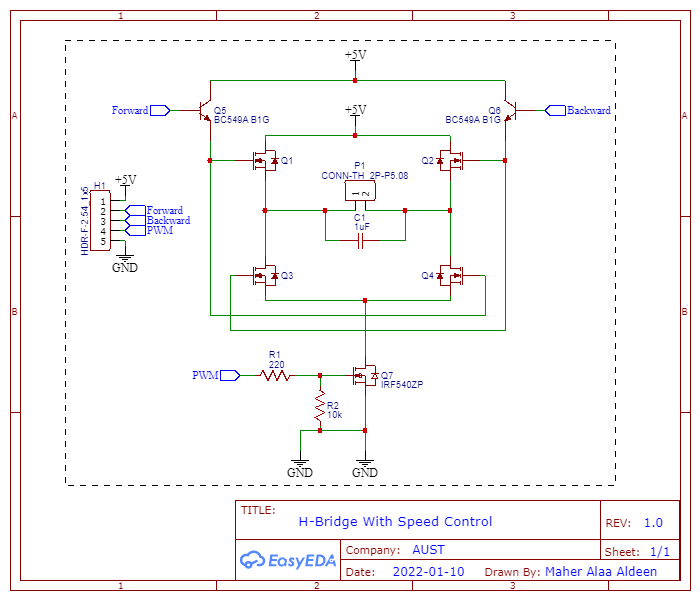
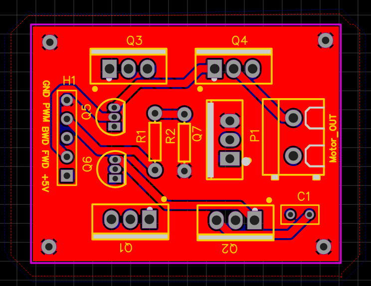
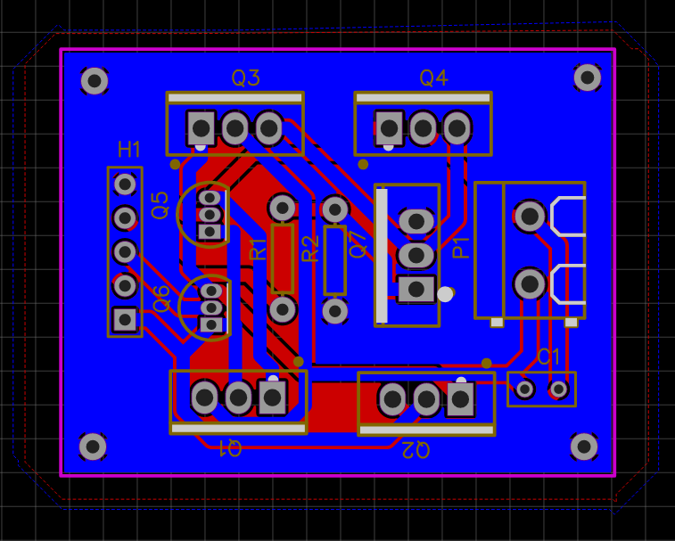
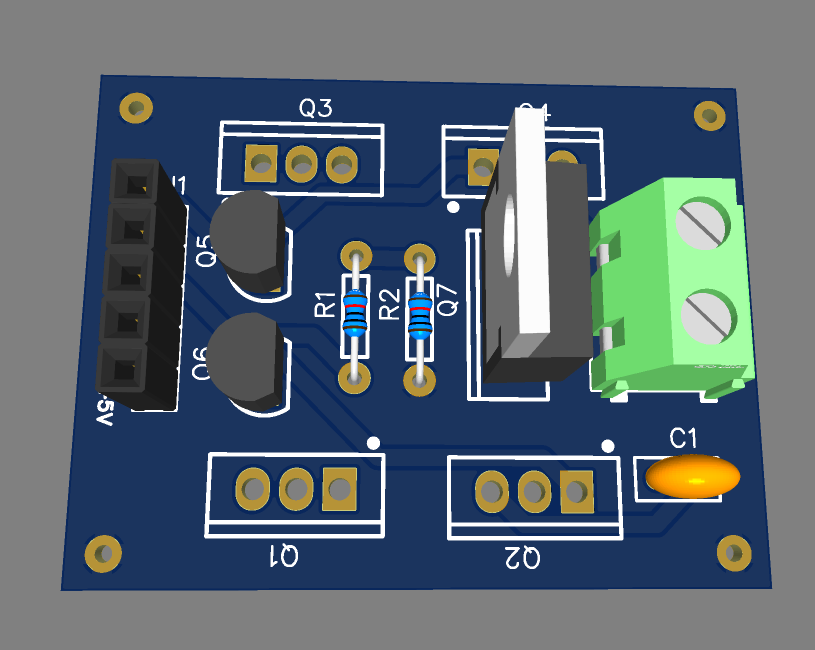
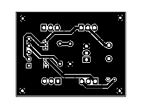
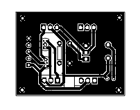
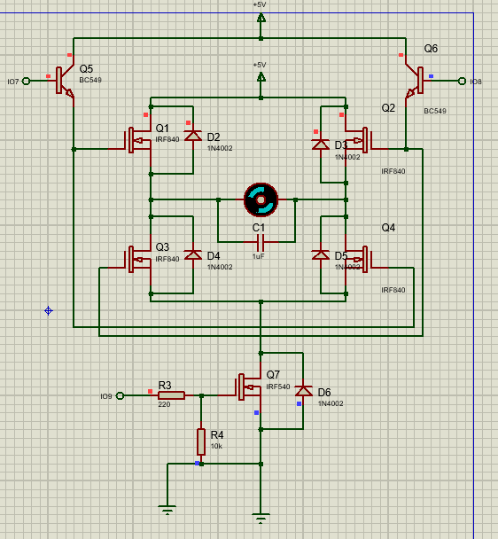

# H-Bridge with DC Motor Speed Control
## Objective
The objective of this project is to design and implement an H-bridge circuit with integrated speed control functionality for a DC motor. The H-bridge allows bidirectional control of the motor, while a MOSFET-based PWM control regulates the motor speed. The design is compatible with an Arduino or other controllers and is inspired by modular motor driver circuits.

## Components Used
1. MOSFETs:
- - IRF840 (x4): Used to form the main H-bridge for bidirectional control.
  - IRF540ZP (x1): Used for speed control by modulating the PWM signal.
2. Transistors: BC549 (x2): For Forward and Backward control inputs.
3. Resistors:
- - Voltage Divider Network:
  - - R1 = 220 Ω
    - R2 = 10 kΩ
4. Capacitor: 1 µF Ceramic Capacitor: Placed across the DC motor terminals to suppress electrical noise.
5. Controller: Arduino or any microcontroller capable of generating PWM signals.

## BOM 



## Circuit Design
### Schematic



1. H-Bridge Structure:
- - Q1 and Q3 (IRF840): Control the current flow for forward motion.
  - Q2 and Q4 (IRF840): Control the current flow for reverse motion.
  - Each MOSFET includes an internal diode to protect against back EMF from the motor.
2. Direction Control:
- - BC549 Transistors:
  - - One transistor (Forward Control) drives Q1 and Q3 for forward motion.
    - The other transistor (Backward Control) drives Q2 and Q4 for reverse motion.
3. Speed Control:
- - A separate MOSFET (IRF540ZP) is connected between the H-bridge ground and the system ground.
  - A voltage divider network (R1 and R2) is used to control the gate voltage of this MOSFET.
  - The PWM signal is fed through the voltage divider to modulate the MOSFET’s gate voltage, controlling the motor's speed.
4. Motor Noise Suppression: A 1 µF ceramic capacitor is connected across the motor terminals to filter out noise generated during operation.

### Working Principle
1. Direction Control:
- - Forward Motion:
  - - The Forward control input activates the first BC549 transistor, turning on Q1 and Q3.
    - Current flows from the power supply through Q1, the motor, and Q3 to ground, driving the motor forward.
  - Backward Motion:
  - - The Backward control input activates the second BC549 transistor, turning on Q2 and Q4.
    - Current flows from the power supply through Q2, the motor, and Q4 to ground, driving the motor in reverse.
2. Speed Control:
- - A PWM signal is applied to the gate of the IRF540ZP MOSFET via the voltage divider network.
  - The duty cycle of the PWM signal determines the average voltage reaching the H-bridge ground, effectively controlling the motor's speed.
3. Protection: The diodes within the IRF840 MOSFETs protect the circuit against voltage spikes caused by the motor's inductive load.

## PCB Design
### PCB Routing





### PCB 3D View



### PCB Layouts
#### Top Layer Layout



#### Bottom Layer Layout



## Arduino Code To test the H-Bridge

Define the Pins
```c
const int forwardPin = 7; // Pin connected to Forward input
const int backwardPin = 8; // Pin connected to Backward input
const int pwmPin = 9;      // Pin connected to PWM input
```

Define the Pins as Outputs
```c
void setup() {
  // Set pin modes
  pinMode(forwardPin, OUTPUT);
  pinMode(backwardPin, OUTPUT);
  pinMode(pwmPin, OUTPUT);
  
  // Ensure motor is stopped initially
  digitalWrite(forwardPin, LOW);
  digitalWrite(backwardPin, LOW);
  analogWrite(pwmPin, 0);
}
```

Test the module
```c
void loop() {
  // Example: Run the motor forward at 50% speed
  digitalWrite(forwardPin, HIGH);
  digitalWrite(backwardPin, LOW);
  analogWrite(pwmPin, 128); // Speed: 0 (stopped) to 255 (full speed)
  delay(5000); // Run for 5 seconds
  
  // Example: Run the motor backward at 75% speed
  digitalWrite(forwardPin, LOW);
  digitalWrite(backwardPin, HIGH);
  analogWrite(pwmPin, 192); // Speed: 0 (stopped) to 255 (full speed)
  delay(5000); // Run for 5 seconds
  
  // Stop the motor
  digitalWrite(forwardPin, LOW);
  digitalWrite(backwardPin, LOW);
  analogWrite(pwmPin, 0); // Stop the motor
  delay(5000); // Wait for 5 seconds
}
```

### Simulation Result



## Advantages of This Design
1. Bidirectional Control: The H-bridge allows the motor to run in both forward and backward directions.
2. Speed Regulation: The PWM control through the IRF540ZP provides smooth and efficient speed adjustment.
3. Component Integration: The use of integrated diodes in the IRF840 MOSFETs simplifies the design.
4. Noise Suppression: The ceramic capacitor reduces electrical noise and enhances motor performance.

## Conclusion
This H-bridge design successfully integrates bidirectional control and speed modulation for a DC motor. By combining IRF840 MOSFETs for directional control and a separate IRF540ZP MOSFET for PWM speed control, the circuit achieves precise operation. The inclusion of protective and noise-suppressing components ensures reliable and efficient motor performance.

